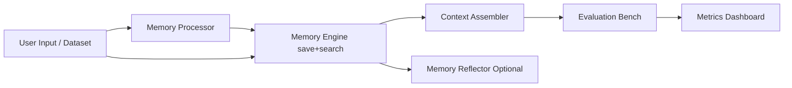

# MemArena

MemArena 是一个 Agent Memory 可视化评测与组装平台。它将传统“记忆系统”拆分为可自由组合的 4+1 模块，通过统一数据契约实现强解耦，并支持一键运行评测输出多维指标。

## 核心特性
- Pipeline 解耦：Processor -> Engine -> Assembler -> (Reflector) -> Evaluation Bench。
- 可视化拼装：前端下拉切换模块实现与模型 Provider。
- Provider 工厂：LLM/Embedding 可在 API、Ollama、Local 之间切换。
- 评测输出：`Precision`、`Faithfulness`、`InfoLoss`，并支持显示原始 Judge 输出。
- VectorEngine 已接入 Chroma 持久化，支持检索参数面板（top_k/min_relevance/strategy/rerank）。
- 支持批量基准评测，返回 JSON 结果与 CSV 报告。

## 架构图


## 目录结构
```text
MemArena/
├─ .env.example
├─ .gitignore
├─ docker-compose.yml
├─ backend/
│  ├─ Dockerfile
│  ├─ pyproject.toml
│  └─ app/
│     ├─ main.py
│     ├─ config.py
│     ├─ registry.py
│     ├─ core/
│     │  └─ interfaces.py
│     ├─ models/
│     │  └─ contracts.py
│     ├─ factories/
│     │  └─ model_factory.py
│     └─ implementations/
│        ├─ processors/basic_processors.py
│        ├─ engines/in_memory_engines.py
│        ├─ assemblers/basic_assemblers.py
│        ├─ reflectors/basic_reflectors.py
│        └─ evaluation/llm_judge_bench.py
├─ frontend/
│  ├─ Dockerfile
│  ├─ package.json
│  ├─ vite.config.ts
│  ├─ tailwind.config.ts
│  └─ src/
│     ├─ App.vue
│     ├─ styles.css
│     ├─ api/client.ts
│     ├─ types/index.ts
│     └─ components/MetricBars.vue
└─ docs/
   ├─ architecture.md
   └─ adding_new_modules.md
```

## 环境准备（Conda + uv）
> 严格按照本项目要求：Conda 管理 Python 环境，依赖安装使用 uv pip。

1. 创建并激活环境
```bash
conda create -n mema_env python=3.12 -y
conda activate mema_env
```

2. 安装 uv
```bash
pip install uv
```

3. 安装后端依赖
```bash
cd backend
uv pip install -e .
```

4. 启动后端
```bash
uvicorn app.main:app --reload --host 0.0.0.0 --port 8000
```

5. 启动前端
```bash
cd ../frontend
npm install
npm run dev
```

## Docker 启动
1. 复制配置
```bash
cp .env.example .env
```

2. 一键启动
```bash
docker compose up --build
```

3. 访问地址
- Frontend: `http://localhost:5173`
- Backend: `http://localhost:8000`
- Neo4j Browser: `http://localhost:7474`
- Chroma: `http://localhost:8001`

## 默认 Provider 路由策略
- LLM 默认：`api`
- Embedding 默认：`ollama`
- Ollama Embedding 默认模型：`Qwen/Qwen3-Embedding-0.6B`

## .env 填写规则
- 建议保留所有键名，不要删除；未使用的 provider 填空值即可。
- 若当前使用 API 作为 LLM：
  - 需要填写 `OPENAI_API_KEY`、`OPENAI_BASE_URL`、`OPENAI_CHAT_MODEL`。
  - `ANTHROPIC_*` 可留空。
  - `OLLAMA_LLM_MODEL` 可留空或保留默认值（不生效）。
- 若 embedding 使用 Ollama：
  - 需要填写 `OLLAMA_BASE_URL` 与 `OLLAMA_EMBED_MODEL`。
  - `LOCAL_EMBED_MODEL_PATH` 可留空。
- Chroma 相关：
  - `CHROMA_PERSIST_DIR` 为持久化目录。
  - `CHROMA_COLLECTION_NAME` 为默认集合名。

## 可选 Memory 方案说明
- 全量方案目录与解释见 `docs/memory_modules_catalog.md`。
- 后续新增 Processor/Engine/Assembler/Reflector/Bench 时，请同步更新该文档。

## 批量评测数据集格式
前端上传 JSON 文件时，建议使用数组格式：

```json
[
  {
    "case_id": "case-1",
    "session_id": "batch-session-a",
    "input_text": "我下周二在上海开评审会，请提醒我带护照",
    "expected_facts": ["下周二", "上海", "评审会", "护照"]
  }
]
```

## API 概览
- `POST /api/benchmark/run`：单条评测。
- `POST /api/benchmark/run-batch`：批量评测，返回 `avg_metrics` 与 `csv_report`。
- `POST /api/benchmark/run-dataset`：运行内置数据集，可指定 `sample_size/start_index`。
- `GET /api/datasets`：查看内置数据集及条目数。
- `GET /api/options`：可选模块与检索策略枚举。

## 内置数据集放置位置
- 将下载的数据集文件放到 `backend/datasets/`，格式为 JSON 数组。
- 前端可直接选择内置数据集，并设置运行条数（Sample Size）与起始位置（Start Index）。
- 每个测试默认可独立会话运行（避免样本间记忆干扰）。

更多说明见：`docs/datasets.md`
