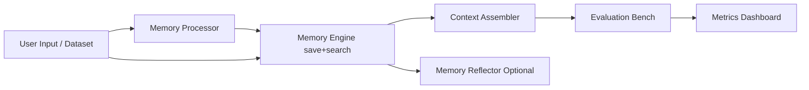

# MemArena

MemArena 是一个 Agent Memory 可视化评测与组装平台。它将传统“记忆系统”拆分为可自由组合的 4+1 模块，通过统一数据契约实现强解耦，并支持一键运行评测输出多维指标。

## 核心特性
- Pipeline 解耦：Processor -> Engine -> Assembler -> (Reflector) -> Evaluation Bench。
- 可视化拼装：前端下拉切换模块实现与模型 Provider。
- Provider 工厂：LLM/Embedding 可在 API、Ollama、Local 之间切换。
- 评测输出：`Precision`、`Faithfulness`、`InfoLoss`，并支持显示原始 Judge 输出。
- VectorEngine 已接入 Chroma 持久化，支持检索参数面板（top_k/min_relevance/strategy/rerank）。
- 支持批量基准评测，返回 JSON 结果与 CSV 报告。

## 架构图


## 目录结构
```text
MemArena/
├─ .env.example
├─ .gitignore
├─ docker-compose.yml
├─ backend/
│  ├─ Dockerfile
│  ├─ pyproject.toml
│  └─ app/
│     ├─ main.py
│     ├─ config.py
│     ├─ registry.py
│     ├─ core/
│     │  └─ interfaces.py
│     ├─ models/
│     │  └─ contracts.py
│     ├─ factories/
│     │  └─ model_factory.py
│     └─ implementations/
│        ├─ processors/basic_processors.py
│        ├─ engines/in_memory_engines.py
│        ├─ assemblers/basic_assemblers.py
│        ├─ reflectors/basic_reflectors.py
│        └─ evaluation/llm_judge_bench.py
├─ frontend/
│  ├─ Dockerfile
│  ├─ package.json
│  ├─ vite.config.ts
│  ├─ tailwind.config.ts
│  └─ src/
│     ├─ App.vue
│     ├─ styles.css
│     ├─ api/client.ts
│     ├─ types/index.ts
│     └─ components/MetricBars.vue
└─ docs/
   ├─ architecture.md
   └─ adding_new_modules.md
```

## 环境准备（Conda + uv）
> 严格按照本项目要求：Conda 管理 Python 环境，依赖安装使用 uv pip。

1. 创建并激活环境
```bash
conda create -n mema_env python=3.12 -y
conda activate mema_env
```

2. 安装 uv
```bash
pip install uv
```

3. 安装后端依赖
```bash
cd backend
uv pip install -e .
```

4. 启动后端
```bash
uvicorn app.main:app --reload --host 0.0.0.0 --port 8000
```

5. 启动前端
```bash
cd ../frontend
npm install
npm run dev
```

## Docker 启动
1. 复制配置
```bash
cp .env.example .env
```

2. 一键启动
```bash
docker compose up --build
```

3. 访问地址
- Frontend: `http://localhost:5173`
- Backend: `http://localhost:8000`
- Neo4j Browser: `http://localhost:7474`
- Chroma: `http://localhost:8001`

## 默认 Provider 路由策略
- LLM 默认：`api`
- Embedding 默认：`ollama`
- Ollama Embedding 默认模型：`Qwen/Qwen3-Embedding-0.6B`

## .env 填写规则
- 建议保留所有键名，不要删除；未使用的 provider 填空值即可。
- 推荐按功能分三组独立配置：
  - `CHAT_*`：聊天链路模型。
  - `EMBEDDING_*`：向量模型链路。
  - `JUDGE_*`：LLM-as-a-Judge 模型。
- 若使用 Reflector 的 LLM 路径，建议额外独立配置 `REFLECTOR_*`，与 Chat/Judge/Summarizer/Entity 解耦。
- 三组可配置为不同 provider 与不同 base URL（例如 Chat 走 API 网关、Judge 走另一个评测网关）。
- 若 `CHAT_*` / `EMBEDDING_*` / `JUDGE_*` 留空，会回退到兼容键（如 `OPENAI_*` / `OLLAMA_*` / `LOCAL_*`）。
- 本地推理设备可用 `LOCAL_INFER_DEVICE=cpu|cuda` 设置默认值，前端也可按任务覆盖。
- Reflector 独立路由键：`REFLECTOR_*`（provider/base_url/api_key/model/ollama/local）。
- Chroma 相关：
  - `CHROMA_PERSIST_DIR` 为持久化目录。
  - `CHROMA_COLLECTION_NAME` 为默认集合名。

### 前端全局大模型设置面板
- 配置面板新增“全局大模型设置（写入 .env）”。
- 前端会调用后端 API：
  - `GET /api/config/global-models`：读取当前 .env 的模型配置。
  - `POST /api/config/global-models`：保存配置并热更新后端运行时 settings。
- 支持按模块独立配置：`Chat/Judge/Summarizer/Entity/Reflector/Embedding`。

## 运行数据与审计日志
- 运行期数据统一放在项目根目录 `data/`，默认包括：
  - `data/memarena.db`（SQLite）
  - `data/chroma/`（Chroma 持久化）
  - `data/logs/request_audit.jsonl`（模型请求审计日志）
- `data/` 已在 `.gitignore` 中忽略，不会进入版本库。
- 当模型调用失败时，可优先检查 `request_audit.jsonl` 中同一 `event` 的失败记录，定位 provider、模型、耗时与错误信息。

## Chroma 维度冲突说明
- 若使用默认集合名 `memarena_memory`，后端会根据 embedding provider + model 自动解析为独立集合名（例如 `memarena_memory_ollama_qwen3_embedding_0_6b`），以避免历史维度冲突。
- 若你手动指定了 `collection_name`，系统会按你指定的名称执行；若该集合已有不同维度数据，接口会返回 400 并提示你更换集合或清理旧数据。

## 可选 Memory 方案说明
- 全量方案目录与解释见 `docs/memory_modules_catalog.md`。
- 后续新增 Processor/Engine/Assembler/Reflector/Bench 时，请同步更新该文档。

### 短期记忆（STM）与长期记忆（LTM）分层
- LTM：继续由 Engine（Vector/Graph/Relational）承担持久化与检索。
- STM：新增运行时策略层，支持以下模式：
  - `None`
  - `SlidingWindow`
  - `TokenBuffer`
  - `RollingSummary`
  - `WorkingMemoryBlackboard`
- API 请求中通过 `retrieval` 传参：
  - `short_term_mode`
  - `stm_window_turns`
  - `stm_token_budget`
  - `stm_summary_keep_recent_turns`
- 后端会将 STM 命中与 LTM 命中合并排序，再交给 Assembler。
- 合并时会按内容去重，避免同一句在 STM/LTM 同时重复展示。
- 前端 Markdown 报告会分栏输出：
  - `Agent Real-time Memory (STM)`
  - `Agent Real-time Memory (LTM)`

### EntityExtractor 新增 mem0 事实提取方案
- 现有 `entity_extractor_method` 除四种结构化方案外，新增：
  - `mem0_user_facts`
  - `mem0_agent_facts`
  - `mem0_dual_facts`
- 约束：`mem0_*` 必须使用 `RelationalEngine`。
- 说明（修正后）：
  - mem0 在处理阶段采用双路抽取：同一轮同时抽取用户事实和助手事实。
  - 两路结果分别带上 `role:user` / `role:assistant` 标签入库。
  - 检索后由 Reflector（推荐 `Consolidator`）输出 `memory_decision`（keep/update/drop）。

### User/Assistant 角色记忆分离
- 所有 Processor 产出的记忆块都带角色标记（`metadata.role` + `role:*` 标签）。
- Engine 存储和检索会保留该角色标记。
- Assembler 注入 prompt 时会分区：
  - `MEMORY_USER`
  - `MEMORY_ASSISTANT`
  - `MEMORY_OTHER`

### Reflector LLM 模式
- 在 `retrieval` 中新增 `reflector_llm_mode`：
  - `Heuristic`
  - `LLM`
  - `LLMWithFallback`（默认）
- 当前支持 LLM 路径的 reflector：
  - `GenerativeReflection`
  - `ConflictResolver`
  - `Consolidator`
  - `ConflictConsolidator`
  - `InsightLinker`
  - `AbstractionReflector`
- 前端配置面板已提供该模式下拉选择。

### Reflector 组合方案（融合 + 纠错）
- 新增 `ConflictConsolidator`：组合 `Consolidator` 与 `ConflictResolver`。
- 典型场景：用户声明“之前说错了，现在更正为 ...”时，同时完成记忆融合与错误纠正。
- 适配引擎：`VectorEngine` / `GraphEngine` / `RelationalEngine`。
- 可独立选择 Reflector 的 Provider：`config.reflector_llm_provider`，并支持 `api|ollama|local`。

### Consolidator 与 ConflictResolver 的区别
- `Consolidator`：去重/融合/压缩，输出候选记忆决策（不直接做最终冲突裁决写回）。
- `ConflictResolver`：处理互斥事实冲突，给出裁决与可写回的 `proposed_resolutions`。
- 两者关系：互补，不是包含关系。

### Assembler 对比汇总脚本
- 单次跑各 Assembler 基准：
  - `python backend/scripts/benchmark_assembler_comparison.py`
- 汇总多份 CSV（`backend/data/reports/assembler_compare_*.csv`）并输出 4 个核心方案排名：
  - `python backend/scripts/summarize_assembler_reports.py`
- 支持可选参数：
  - `--report-dir` 自定义报告目录
  - `--csv-glob` 自定义 CSV 匹配模式
  - `--assemblers` 指定方案列表（逗号分隔）
  - `--weights` 自定义评分权重
  - 示例：`python backend/scripts/summarize_assembler_reports.py --assemblers SystemInjector,ReasoningChain --weights precision=0.4,faithfulness=0.3,info_loss=0.2,context_distraction=0.05,seed_touch=0.05`
- 输出文件：
  - `backend/data/reports/assembler_summary_*.json`
  - `backend/data/reports/assembler_summary_*.md`

## 批量评测数据集格式
前端上传 JSON 文件时，建议使用数组格式：

```json
[
  {
    "case_id": "case-1",
    "session_id": "batch-session-a",
    "input_text": "我下周二在上海开评审会，请提醒我带护照",
    "expected_facts": ["下周二", "上海", "评审会", "护照"]
  }
]
```

## API 概览
- `POST /api/benchmark/run`：单条评测。
- `POST /api/benchmark/run-batch`：批量评测，返回 `avg_metrics` 与 `csv_report`。
- `POST /api/benchmark/run-dataset`：运行内置数据集，可指定 `sample_size/start_index`。
- `POST /api/benchmark/run-batch-async`：异步批量任务（适合大数据量）。
- `POST /api/benchmark/run-dataset-async`：异步内置数据集任务。
- `GET /api/benchmark/runs/{run_id}`：查询任务进度（`completed/total`）和最终结果。
- `GET /api/audit/runs/{run_id}`：按 run_id 查询请求审计日志（支持 `limit` 参数）。
- `GET /api/datasets`：查看内置数据集及条目数。
- `GET /api/options`：可选模块与检索策略枚举。

## 评估标准文档
- 评估指标定义、衍生指标、阈值建议、代表性边界与高挑战测试设计已独立到：`docs/evaluation_criteria.md`。
- 前端结果面板会展示核心三指标与附加稳定性信号，便于做更真实的横向对比。

## 内置数据集放置位置
- 将下载的数据集文件放到 `backend/datasets/`，格式为 JSON 数组。
- 前端可直接选择内置数据集，并设置运行条数（Sample Size）与起始位置（Start Index）。
- 每个测试默认可独立会话运行（避免样本间记忆干扰）。
- 前端支持配置请求超时（ms），并在异步批量任务中显示真实进度 x/y。

更多说明见：`docs/datasets.md`
