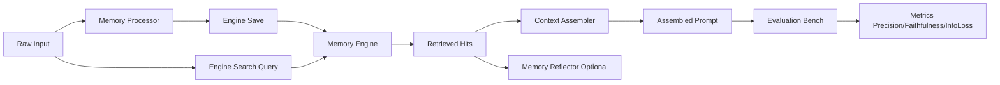

# MemArena 架构说明

## 1. 设计目标
MemArena 以数据生命周期为中心，将 Memory 系统拆分为 4+1 个模块（4 个执行模块 + 1 个评估台），核心价值是：
- 保持模块间强解耦。
- 允许独立替换任一模块实现。
- 支持可视化拼装与可重复评测。

## 2. 4+1 模块定义
1. Memory Processor（记忆预处理器）
2. Memory Engine（记忆黑盒引擎：存储+检索统一体）
3. Context Assembler（上下文组装器）
4. Memory Reflector（异步反思器，可选）
5. Evaluation Bench（评估台）

## 3. 数据契约与解耦方式
所有模块仅通过 Pydantic 数据模型通信，模型定义位于 `backend/app/models/contracts.py`。
这样可以确保：
- 任一模块实现不依赖其他模块的内部细节。
- 前后端可复用同一套字段语义。
- 评估流程可复现，便于 A/B 对比。

## 4. 主流程数据流

## 5. 模块替换原则
- 处理器只负责从原始输入产生标准 `MemoryChunk`。
- 引擎必须同时实现 `save()` 与 `search()`。
- 组装器只负责 Prompt 结构化，不触碰底层检索逻辑。
- 反思器为异步旁路，不影响主链路响应。
- 评估台只依赖检索结果与组装结果，独立可测。

## 6. 当前内置实现
- Processor: `RawLogger`, `Summarizer`, `EntityExtractor`
- Engine: `VectorEngine`（Chroma 持久化实现）, `GraphEngine`（内存占位）, `RelationalEngine`（内存占位）
- Assembler: `SystemInjector`, `XMLTagging`, `TimelineRollover`
- Reflector: `GenerativeReflection`, `ConflictResolver`
- Bench: `LLMJudgeBench`（真实 LLM-as-a-Judge，支持 API/Ollama，失败时回退规则评估）

## 7. 方案目录维护
- 所有可选模块方案与语义定义集中维护在 `docs/memory_modules_catalog.md`。
- 新增方案时，请先实现代码，再更新方案目录与 `docs/adding_new_modules.md`。
